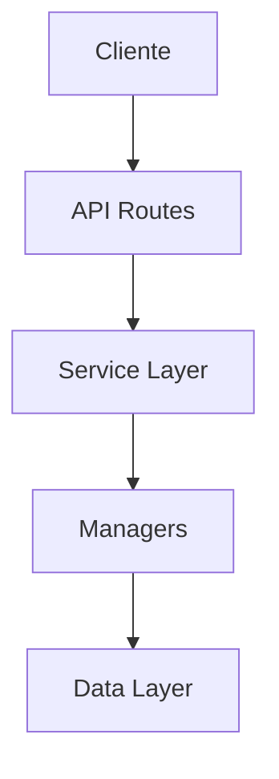

# Padrões de Documentação Técnica

## Objetivo

Estabelecer convenções claras para nomenclatura, estrutura e organização da documentação técnica do projeto, garantindo consistência e facilidade de navegação.

## Estrutura de Diretórios

```
docs/
├── DOCUMENTATION_STANDARDS.md    # Este arquivo (meta-documentação)
├── INDEX.md                      # Índice principal
├── ARCHITECTURE_OVERVIEW.md      # Visão geral da arquitetura
│
├── architecture/                 # Arquitetura e design de sistemas
│   ├── ROADMAP_SYSTEM.md
│   └── PROGRESS_TRACKING.md
│
├── guides/                       # Guias práticos e tutoriais
│   ├── UV_GUIDE.md
│   └── TESTING_GUIDE.md
│
├── refactoring/                  # Documentos de refatoração
│   ├── SOLID_DRY_ACHIEVEMENTS.md
│   ├── PROGRESS_MANAGER.md
│   └── APP_ROUTES.md
│
├── implementation/               # Documentos de implementação
│   ├── ROADMAP_IMPLEMENTATION.md
│   ├── EXERCISE_IMPROVEMENTS.md
│   ├── SUMMARY.md
│   └── FINAL_SUMMARY.md
│
├── maintenance/                  # Manutenção e correções
│   ├── PROGRESS_FIX.md
│   └── ROLLBACK_NOTES.md
│
└── decisions/                    # Decisões arquiteturais (ADRs)
    ├── 001_strategy_pattern_conditions.md
    └── 002_dependency_injection.md
```

## Convenções de Nomenclatura

### Formato Geral

```
[CATEGORIA]_[COMPONENTE]_[TIPO].md
```

### Categorias

| Prefixo | Categoria | Exemplo |
|---------|-----------|---------|
| `ARCH_` | Arquitetura | `ARCH_LAYERED_DESIGN.md` |
| `REFACTOR_` | Refatoração | `REFACTOR_PROGRESS_MANAGER.md` |
| `GUIDE_` | Guia/Tutorial | `GUIDE_UV_SETUP.md` |
| `ADR_` | Decisão Arquitetural | `ADR_001_STRATEGY_PATTERN.md` |
| `API_` | Documentação de API | `API_PROGRESS_ENDPOINTS.md` |
| `SPEC_` | Especificação | `SPEC_ACHIEVEMENTS_SYSTEM.md` |
| `IMPL_` | Implementação | `IMPL_ROADMAP_SYSTEM.md` |
| `MAINT_` | Manutenção | `MAINT_PROGRESS_FIX.md` |

### Componentes

Use nomes descritivos e consistentes:
- `ACHIEVEMENTS` - Sistema de conquistas
- `PROGRESS` - Sistema de progresso
- `ROUTES` - Rotas da aplicação
- `MANAGERS` - Gerenciadores de dados
- `SERVICES` - Camada de serviços
- `VALIDATORS` - Validadores

### Tipos

| Sufixo | Tipo | Uso |
|--------|------|-----|
| `_OVERVIEW` | Visão geral | Documentos introdutórios |
| `_DESIGN` | Design | Decisões de design |
| `_IMPLEMENTATION` | Implementação | Detalhes de implementação |
| `_PROPOSAL` | Proposta | Mudanças propostas |
| `_MIGRATION` | Migração | Guias de migração |

## Estrutura de Documento

### Template Padrão

```markdown
# [Título do Documento]

## Metadata
- **Status**: [Draft | Review | Approved | Implemented | Deprecated]
- **Autor**: [Nome/Time]
- **Data**: [YYYY-MM-DD]
- **Última Atualização**: [YYYY-MM-DD]
- **Relacionado**: [Links para docs relacionados]

## Resumo Executivo
[2-3 parágrafos resumindo o documento]

## Contexto
[Por que este documento existe? Qual problema resolve?]

## [Conteúdo Principal]
[Seções específicas do tipo de documento]

## Decisões
[Decisões tomadas e suas justificativas]

## Impacto
[Impacto em outros componentes/sistemas]

## Próximos Passos
[Ações necessárias]

## Referências
[Links externos, documentos relacionados]
```

### Templates por Tipo

#### Refatoração

```markdown
# REFACTOR_[COMPONENTE]

## Metadata
- **Status**: Proposed
- **Impacto**: [Alto | Médio | Baixo]
- **Esforço Estimado**: [Horas/Dias]

## Problema Identificado
[Descrição do problema atual]

## Proposta de Solução
[Solução detalhada]

## Estrutura Proposta
[Diagramas, código exemplo]

## Benefícios
[Melhorias esperadas]

## Riscos
[Riscos e mitigações]

## Plano de Implementação
[Passos detalhados]

## Métricas de Sucesso
[Como medir o sucesso]
```

#### Decisão Arquitetural (ADR)

```markdown
# ADR_[NÚMERO]_[TÍTULO]

## Metadata
- **Status**: [Proposed | Accepted | Deprecated | Superseded]
- **Data**: YYYY-MM-DD
- **Decisores**: [Nomes]

## Contexto
[Situação e forças em jogo]

## Decisão
[Decisão tomada]

## Consequências
[Resultados da decisão - positivos e negativos]

## Alternativas Consideradas
[Outras opções avaliadas]
```

#### Guia

```markdown
# GUIDE_[TÓPICO]

## Metadata
- **Nível**: [Iniciante | Intermediário | Avançado]
- **Tempo Estimado**: [Minutos]

## Pré-requisitos
[O que é necessário saber/ter]

## Objetivo
[O que você aprenderá]

## Passo a Passo
[Instruções detalhadas]

## Troubleshooting
[Problemas comuns e soluções]

## Próximos Passos
[O que fazer depois]
```

#### Implementação

```markdown
# IMPL_[FEATURE]

## Metadata
- **Status**: [Completo | Em Progresso | Planejado]
- **Data**: YYYY-MM-DD
- **Desenvolvedor**: [Nome]

## Resumo
[Breve descrição da feature implementada]

## Funcionalidades Implementadas
[Lista de funcionalidades]

## Arquivos Criados/Modificados
[Lista de arquivos com descrição]

## Como Usar
[Instruções de uso]

## Testes
[Como testar a implementação]

## Próximos Passos
[Melhorias futuras]
```

#### Manutenção

```markdown
# MAINT_[ISSUE]

## Metadata
- **Status**: [Resolvido | Em Progresso | Pendente]
- **Data**: YYYY-MM-DD
- **Prioridade**: [Alta | Média | Baixa]

## Problema Identificado
[Descrição do problema]

## Causas
[Causas raiz identificadas]

## Correções Implementadas
[Detalhes das correções]

## Como Testar
[Passos para verificar a correção]

## Prevenção
[Como evitar o problema no futuro]
```

## Nomenclatura de Arquivos

### Regras

1. **SEMPRE em MAIÚSCULAS** para palavras-chave
2. **Snake_case** para separação: `REFACTOR_PROGRESS_MANAGER.md`
3. **Sem espaços**: Use underscore `_`
4. **Descritivo**: Nome deve indicar conteúdo
5. **Versionamento**: Use números para ADRs: `ADR_001_`, `ADR_002_`

### Exemplos Corretos ✅

```
docs/
├── ARCHITECTURE_OVERVIEW.md
├── REFACTOR_PROGRESS_MANAGER.md
├── GUIDE_UV_SETUP.md
├── ADR_001_STRATEGY_PATTERN.md
├── API_PROGRESS_ENDPOINTS.md
└── SPEC_ACHIEVEMENTS_SYSTEM.md
```

### Exemplos Incorretos ❌

```
docs/
├── architecture overview.md        # Espaços
├── refactoring-progress.md         # Minúsculas, hífen
├── uv guide.md                     # Espaços, minúsculas
├── strategy-pattern-decision.md    # Sem prefixo ADR
└── achievements.md                 # Não descritivo
```

## Organização por Diretórios

### `/docs` (Raiz)

Apenas documentos de alto nível:
- `INDEX.md` - Índice principal
- `ARCHITECTURE_OVERVIEW.md` - Visão geral
- `DOCUMENTATION_STANDARDS.md` - Este arquivo

### `/docs/architecture`

Documentos sobre arquitetura e design de sistemas:
- Padrões arquiteturais
- Diagramas de sistema
- Fluxos de dados

### `/docs/refactoring`

Documentos de refatoração:
- Propostas de refatoração
- Análises de código
- Planos de melhoria

### `/docs/guides`

Guias práticos e tutoriais:
- Setup e instalação
- Como fazer X
- Troubleshooting

### `/docs/implementation`

Documentos de implementação:
- Resumos de features implementadas
- Detalhes técnicos de implementação
- Histórico de desenvolvimento

### `/docs/maintenance`

Documentos de manutenção e correções:
- Correções de bugs
- Rollbacks e reversões
- Notas de manutenção

### `/docs/decisions`

Architectural Decision Records (ADRs):
- Decisões importantes
- Contexto e consequências
- Histórico de mudanças

### `/docs/api`

Documentação de APIs:
- Endpoints
- Contratos
- Exemplos de uso

## Status de Documentos

Use badges no topo do documento:

```markdown


```

Ou simplesmente:

```markdown
**Status**: 🟡 Draft | 🟠 Review | 🟢 Approved | 🔵 Implemented | 🔴 Deprecated
```

## Versionamento

### Documentos Vivos

Documentos que evoluem (ex: ARCHITECTURE_OVERVIEW.md):
- Manter histórico no próprio documento
- Seção "Histórico de Mudanças" no final

```markdown
## Histórico de Mudanças

| Data | Versão | Mudanças | Autor |
|------|--------|----------|-------|
| 2025-12-07 | 1.1 | Adicionada seção X | João |
| 2025-12-01 | 1.0 | Versão inicial | Maria |
```

### Decisões Arquiteturais (ADRs)

ADRs são imutáveis após aprovação:
- Nunca editar ADR aprovado
- Criar novo ADR que supersede o anterior
- Marcar ADR antigo como "Superseded by ADR_XXX"

## Links e Referências

### Links Internos

Use caminhos relativos:

```markdown
[Refatoração do ProgressManager](refactoring/PROGRESS_MANAGER.md)
[Visão Geral](../ARCHITECTURE_OVERVIEW.md)
```

### Links Externos

Sempre com descrição clara:

```markdown
[SOLID Principles - Wikipedia](https://en.wikipedia.org/wiki/SOLID)
```

## Diagramas

### Ferramentas Recomendadas

1. **Mermaid** (preferido - renderiza no GitHub)
2. **PlantUML**
3. **Draw.io** (exportar como SVG)

### Exemplo Mermaid

```markdown
## Arquitetura


```

## Checklist de Qualidade

Antes de finalizar um documento:

- [ ] Nome segue convenção `[CATEGORIA]_[COMPONENTE]_[TIPO].md`
- [ ] Metadata completa (status, data, autor)
- [ ] Resumo executivo presente
- [ ] Seções bem estruturadas
- [ ] Links funcionando
- [ ] Código formatado corretamente
- [ ] Diagramas renderizando
- [ ] Revisão ortográfica
- [ ] Adicionado ao INDEX.md
- [ ] Status badge atualizado

## Manutenção

### Revisão Periódica

- **Mensal**: Revisar documentos em Draft/Review
- **Trimestral**: Atualizar ARCHITECTURE_OVERVIEW
- **Anual**: Deprecar documentos obsoletos

### Deprecação

Quando deprecar um documento:

1. Adicionar badge `🔴 Deprecated`
2. Adicionar nota no topo:
   ```markdown
   > ⚠️ **DEPRECATED**: Este documento foi substituído por [NOVO_DOC.md](link)
   ```
3. Mover para `/docs/deprecated/`
4. Atualizar INDEX.md

## Exemplos Práticos

### Renomeação de Documentos Existentes

```bash
# Antes (inconsistente)
docs/REFACTORING_SOLID_DRY.md
docs/REFACTORING_PROGRESS_MANAGER.md
docs/REFACTORING_APP_ROUTES.md

# Depois (consistente)
docs/refactoring/SOLID_DRY_ACHIEVEMENTS.md
docs/refactoring/PROGRESS_MANAGER.md
docs/refactoring/APP_ROUTES.md
```

### Criação de Novo Documento

```bash
# 1. Escolher categoria e nome
docs/refactoring/EXERCISE_MANAGER.md

# 2. Copiar template apropriado
cp docs/templates/REFACTOR_TEMPLATE.md docs/refactoring/EXERCISE_MANAGER.md

# 3. Preencher metadata e conteúdo

# 4. Adicionar ao INDEX.md

# 5. Commit com mensagem descritiva
git commit -m "docs: add refactoring proposal for ExerciseManager"
```

## Ferramentas

### Validação Automática

Criar script para validar nomenclatura:

```bash
# scripts/validate_docs.sh
#!/bin/bash

# Verificar nomenclatura
find docs/ -name "*.md" | while read file; do
    basename=$(basename "$file")
    if [[ ! $basename =~ ^[A-Z_]+\.md$ ]]; then
        echo "❌ Nome inválido: $file"
    fi
done
```

### Geração de Índice

Script para gerar INDEX.md automaticamente:

```python
# scripts/generate_index.py
import os
from pathlib import Path

def generate_index():
    docs_dir = Path("docs")
    # Escanear diretórios e gerar índice
    # ...
```

## Referências

- [Architectural Decision Records](https://adr.github.io/)
- [Documentation Guide - Write the Docs](https://www.writethedocs.org/guide/)
- [Markdown Guide](https://www.markdownguide.org/)
- [Mermaid Documentation](https://mermaid.js.org/)

---

**Última Atualização**: 2025-12-07
**Versão**: 1.0
**Status**: 🟢 Approved
