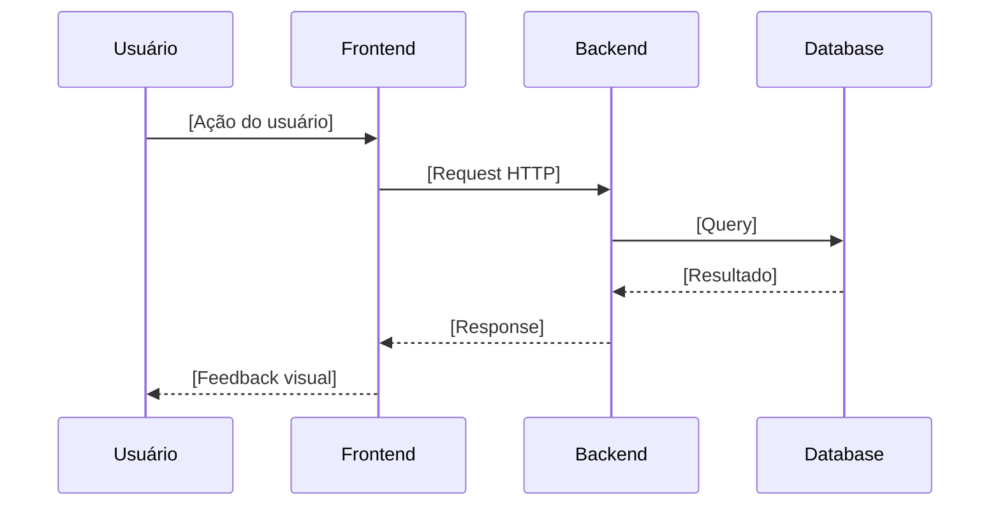

# Design - [Nome da Feature]

> **Documento**: design.md
> **Criado em**: YYYY-MM-DD
> **Última atualização**: YYYY-MM-DD
> **Status**: 🔄 Em elaboração | ✅ Aprovado

---

## 📐 1. Arquitetura

### 1.1 Visão Geral

[Descrição de alto nível da arquitetura da solução]

### 1.2 Diagrama de Arquitetura

```
┌─────────────┐     ┌─────────────┐     ┌─────────────┐
│  Frontend   │────▶│   Backend   │────▶│  Database   │
└─────────────┘     └─────────────┘     └─────────────┘
```

### 1.3 Componentes

| Componente | Responsabilidade | Localização |
|------------|-----------------|-------------|
| [Nome] | [Descrição] | `path/to/file` |
| [Nome] | [Descrição] | `path/to/file` |

---

## 🔄 2. Fluxo de Dados

### 2.1 Diagrama de Sequência



### 2.2 Fluxos Principais

#### Fluxo 1: [Nome do Fluxo]
1. [Passo 1]
2. [Passo 2]
3. [Passo 3]

#### Fluxo 2: [Nome do Fluxo]
1. [Passo 1]
2. [Passo 2]
3. [Passo 3]

---

## 🔌 3. Interfaces

### 3.1 APIs / Endpoints

#### `[METHOD] /api/endpoint`

**Descrição**: [O que o endpoint faz]

**Request**:
```json
{
  "campo": "valor"
}
```

**Response** (200 OK):
```json
{
  "campo": "valor",
  "resultado": true
}
```

**Erros**:
| Código | Descrição |
|--------|-----------|
| 400 | Bad Request - [motivo] |
| 404 | Not Found - [motivo] |
| 500 | Internal Server Error |

### 3.2 Componentes de UI

| Componente | Descrição | Props |
|-----------|-----------|-------|
| [Nome] | [Descrição] | `prop1`, `prop2` |

---

## 📊 4. Modelos de Dados

### 4.1 Entidades

#### [NomeEntidade]

```python
class NomeEntidade:
    id: str           # Identificador único
    campo1: str       # Descrição do campo
    campo2: int       # Descrição do campo
    created_at: datetime
    updated_at: datetime
```

#### Estrutura JSON

```json
{
  "id": "uuid",
  "campo1": "valor",
  "campo2": 123,
  "created_at": "2024-01-01T00:00:00Z",
  "updated_at": "2024-01-01T00:00:00Z"
}
```

### 4.2 Relacionamentos

```
[Entidade1] 1───────N [Entidade2]
                      │
                      └────N [Entidade3]
```

---

## ⚠️ 5. Tratamento de Erros

### 5.1 Estratégia Geral

[Descrição da estratégia de tratamento de erros]

### 5.2 Erros Esperados

| Erro | Causa | Ação |
|------|-------|------|
| [TipoErro] | [Causa] | [Como tratar] |

### 5.3 Logging

- Nível de log para erros: ERROR
- Nível de log para avisos: WARNING
- Formato: `[TIMESTAMP] [LEVEL] [MODULE] - Message`

---

## 🧪 6. Estratégia de Testes

### 6.1 Testes Unitários

| Módulo | Arquivo de Teste | Cobertura Alvo |
|--------|-----------------|----------------|
| [Módulo] | `test_modulo.py` | 80% |

### 6.2 Testes de Integração

| Cenário | Descrição |
|---------|-----------|
| [Cenário 1] | [Descrição do teste] |
| [Cenário 2] | [Descrição do teste] |

### 6.3 Testes E2E

| Fluxo | Passos |
|-------|--------|
| [Fluxo] | [Passos do teste] |

---

## 📝 7. Considerações de Implementação

### 7.1 Princípios SOLID Aplicados

- **S (Single Responsibility)**: [Como aplicado]
- **O (Open/Closed)**: [Como aplicado]
- **L (Liskov Substitution)**: [Como aplicado]
- **I (Interface Segregation)**: [Como aplicado]
- **D (Dependency Inversion)**: [Como aplicado]

### 7.2 Código Reutilizável (DRY)

- [Componente/função reutilizável identificado]
- [Outro componente reutilizável]

### 7.3 Performance

- [Consideração de performance]
- [Otimização planejada]

### 7.4 Segurança

- [Consideração de segurança]
- [Validação/sanitização necessária]

---

## ✅ Checklist de Aprovação

- [ ] Arquitetura está clara e documentada
- [ ] Diagramas de sequência cobrem fluxos principais
- [ ] APIs estão bem definidas com request/response
- [ ] Modelos de dados estão especificados
- [ ] Tratamento de erros está planejado
- [ ] Estratégia de testes está definida
- [ ] Princípios SOLID foram considerados
- [ ] Não há duplicação de responsabilidades

---

**Aprovado por**: [Nome]
**Data de Aprovação**: YYYY-MM-DD
